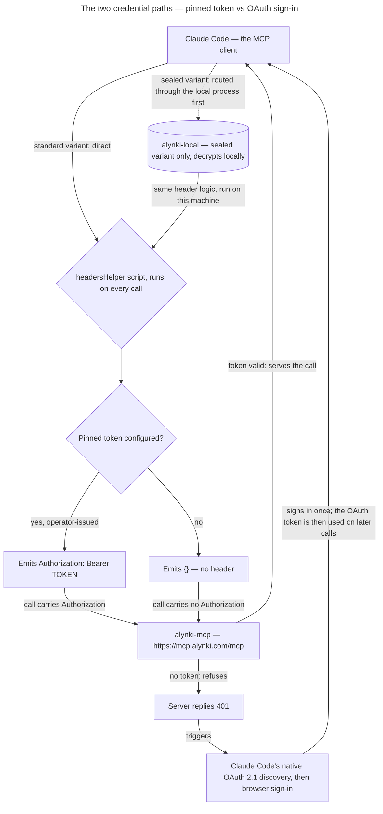

# Alynki plugin

> Knowledge is inherited, not rediscovered.

The Claude Code plugin for Alynki, the business context layer — it loads your organisation's
governed context into every session: the policy and product context that applies to the scope
your credential holds and, where that scope sits in a workflow, the steps, checks and runs that
define how the work is done. Alynki delivers to a principal only what that principal is granted;
it does not constrain what an agent obtains from other sources.

Two variants ship from this marketplace: **`alynki`** (the standard install) and
**`alynki-sealed`** (for organisations that have opted into sealing — context is decrypted
locally on your machine). Install one or the other, as your Alynki operator directs. Once
installed they behave identically: same tools, same context.

## Credential paths

Both variants offer the same two paths to every colleague, and a pinned token always wins over
sign-in when both are present:



Key: rectangle — a process or service; diamond — a decision; cylinder — a local, on-machine
credential store (sealed variant only); dashed edge — sealed-variant-only routing.

## Install — `alynki` (standard)

```
/plugin marketplace add alynki/plugin
/plugin install alynki@alynki-marketplace
/reload-plugins
```

That is the whole install. **The MCP connection is bundled** — there is no separate
`claude mcp add` step, and nothing to type but your own credential.

**To sign in with your own identity**, install and use it — nothing to configure; see
*Credential paths* above.

**If your operator issued you a pinned token**, put it in the plugin's **Alynki API token** field
(`/plugin`, or `--config token=…` on install). Automation — CI, an agent — always uses a pinned
token, since sign-in needs a human in a browser.

⚠️ One plugin serves both paths because the connection uses a `headersHelper` script rather than a
static header. A **static** `headers.Authorization` key would disable Claude Code's OAuth fallback
unconditionally, *even when its interpolated value is empty* — so the choice has to be made at
connection time, from configuration, never from a key in `.mcp.json`.

## Install — `alynki-sealed`

For organisations that have opted into sealing. **A local process, `alynki-local`, runs on
your machine**: Claude Code launches it for each session, it calls the same hosted Alynki
endpoint, and it decrypts your context locally. The hosted service stores and serves
ciphertext only; your organisation key never leaves this machine.

`alynki-local` must be installed and on your `PATH` before the plugin can serve context.
Your Alynki operator provides the binary for your platform — installing the plugin does not
install it. Confirm before continuing:

```sh
which alynki-local     # must print a path
```

(Building from source — `go install ./cmd/alynki-local` from an `alynki/server` checkout — is an
operator/developer path, not a colleague path; per-platform packaging and signing are tracked at
alynki/alynki#231.) Then:

```
/plugin marketplace add alynki/plugin
/plugin install alynki-sealed@alynki-marketplace
/reload-plugins
```

Installing prompts for three values, **all optional** (every one can instead be set up by running
`alynki-local` directly, once, from a terminal). ⚠️ **No tenant is asked for.** Your tenant is
resolved from your credential, server-side — see *Status* below.

- **Alynki API token** — leave blank and run `alynki-local login` instead to sign in with your
  own identity; an existing colleague with a pinned token keeps it, not switches, until identity
  linking ships. A token pasted here is stored in this plugin's own `settings.json`, plaintext —
  `alynki-local login`'s own credential store (your OS keychain, with a file fallback) is the
  better place for a long-lived credential.
- **Alynki organisation key** and **Alynki key id** — leave both blank and run
  `alynki-local key import` instead (with `ALYNKI_KEY`/`ALYNKI_KEY_ID` set in your shell). The
  key then lives in `alynki-local`'s own credential store — your OS keychain, never this
  plugin's configuration.

Non-interactive form, if you are pasting values directly:

```
claude plugin install alynki-sealed@alynki-marketplace --config token=<token> --config key=<key> --config key_id=<key-id>
```

## What it installs

- An MCP connection exposing the Alynki tools. What a session is offered depends on the
  **class of your credential**: an agent (pinned) credential is offered only `load_context` and
  `save_context`, with **no address argument** — scope comes entirely from the token, so an
  injected instruction has no way to redirect it. A human (interactive) credential is offered
  all thirty-four tools, each with a matching typed slash prompt (`/load`, `/create-run`,
  and so on) taking one whole-string argument. What each tool does, how confirm tokens, run
  holds and non-composing reads work, and how large a body it can carry are the server's own
  contract, not this plugin's — see `alynki/alynki` `docs/architecture/`.
- **Large context is chunked and paged for you on the human surface**; a pinned (agent) session
  receives its payload whole. The tool descriptions and prompts carry the exact rules.
- In the standard variant the connection goes directly to Alynki's hosted server; in the
  sealed variant it goes to the local `alynki-local` process, which calls the hosted server,
  decrypts the result, and does the chunking and paging on this machine so the hosted service
  sees only whole ciphertext. The tool names and the rendered payload are the same either way.
- `SessionStart` and `SubagentStart` hooks that instruct every session — and every subagent —
  to call `load_context` first (`SessionStart` emits both `initialUserMessage` and
  `additionalContext`; `SubagentStart` emits `additionalContext`).

⚠️ A new sealed capability reaches you only with a redistributed `alynki-local` binary — that is
not only about new TOOLS. The sealed variant declares its tool descriptions,
renders its prompts and answers the server's own `instructions` string *locally*, inside
`alynki-local` — so a change to the wording of any of the three also reaches you only with a
redistributed binary. Nothing warns you of a wording-only change: the staleness nudge compares
tool **schemas** byte-for-byte, and a re-worded description, prompt or instructions string leaves
the schema untouched — an older `alynki-local` keeps serving the stale wording rather than
mis-declaring it. **Reinstall `alynki-local` whenever the sealed plugin's version moves**, not
only when a tool is added. A genuine schema change is the one case an old binary catches itself:
it withholds the changed tool — one `OUT OF DATE` log line — until rebuilt. A changed tool
*result*, by contrast, needs no rebuild: results are relayed from the hosted server verbatim.

## After installing — grant standing permission

The plugin cannot grant its own tools permission: nothing in the plugin manifest can pre-approve
a tool call, and there is no install-time hook. Left alone, each session prompts for `load_context`
the first time it runs, and accepting the prompt saves the grant to that **repository only** — a
session started anywhere else prompts again.

Run once, in any session:

```
/alynki:setup
```

(`/alynki-sealed:setup` for the sealed variant.) It proposes adding every Alynki tool to
`permissions.allow` in your own `~/.claude/settings.json` — machine-wide, not repository-scoped —
and shows the edit before applying it.

It also adds six exact-name rules to `permissions.ask`, so the tools that change who has access or
create a credential — `grant_principal`, `revoke_principal`, `invite_principal`,
`revoke_principal_invite`, `create_principal_agent` and `revoke_principal_agent` — still prompt
before every call. Claude Code evaluates deny, then ask, then allow, so an ask rule wins over the
wildcard. Re-running the command adds any ask rule that is missing and changes nothing else; a
machine set up before these rules existed needs it run once more. ⚠️ The gate lives in this client:
a non-interactive `-p` run without `--permission-prompt-tool` cannot answer the prompt, `dontAsk`
denies these calls, and another MCP client may not prompt at all.

⚠️ **This command still prompts once, for its own write.** `~/.claude` is a protected path, so no
allow rule can suppress that prompt. It removes every *subsequent* Alynki prompt, not its own.

To grant it by hand instead of running the command, add to `~/.claude/settings.json`:

```json
{
  "permissions": {
    "allow": [
      "mcp__plugin_alynki_alynki__*"
    ],
    "ask": [
      "mcp__plugin_alynki_alynki__grant_principal",
      "mcp__plugin_alynki_alynki__revoke_principal",
      "mcp__plugin_alynki_alynki__invite_principal",
      "mcp__plugin_alynki_alynki__revoke_principal_invite",
      "mcp__plugin_alynki_alynki__create_principal_agent",
      "mcp__plugin_alynki_alynki__revoke_principal_agent"
    ]
  }
}
```

(substitute `plugin_alynki-sealed_alynki` for the sealed variant, in all seven entries). This grants
every Alynki tool, including ones added after you run this — the wildcard's `plugin_alynki_alynki`
segment is exact, so it can only ever match Alynki's own server — and keeps the prompt on the six
access-changing tools. Preserve any existing `permissions.allow` and `permissions.ask` entries
already in the file.

## Status

- **One shared endpoint — `https://mcp.alynki.com/mcp`.** Your tenant is resolved server-side from
  the credential you present, never from the URL, so **neither variant asks you for a tenant** and
  both `.mcp.json` files carry the same literal URL. ⚠️ Not only a convenience: **RFC 9728 §3.3
  requires** the `resource` identifier a client is handed to be identical to the URL it dialled,
  so one shared dialled URL and one shared resource identifier are the same decision. For local
  development against a local server, override with an **uncommitted** working-copy change —
  `main` only ever carries production.
- **Visibility:** this repository is **private**; making it public is a deliberate founder
  decision, taken separately. While private, colleagues install using their own granted git
  access (⚠️ a clone failing with "Repository not found" means the SSH key GitHub picked lacks
  access — pass an explicit git URL for the right identity).

## Content policy — read before adding anything

**Assume this repository becomes public.** It exists precisely so the plugin can be
installed without access to `alynki/alynki`, which is private.

This repository contains **only** the plugin and its marketplace manifest. The following are
**explicitly excluded** and must never be added: VISION, architecture documents, feature
specifications, patent material, the risk register, competitor analysis — anything carrying
a confidentiality banner. CI greps every push for the banner and fails the build if one
appears.

Nothing customer-specific may appear in the plugin either. The plugin is identical for every
installer; a node label or tenant name in these files would leak one customer's structure to
all others.

## Licence

MIT — see [LICENSE](LICENSE). It covers the plugin configuration in this repository only.
