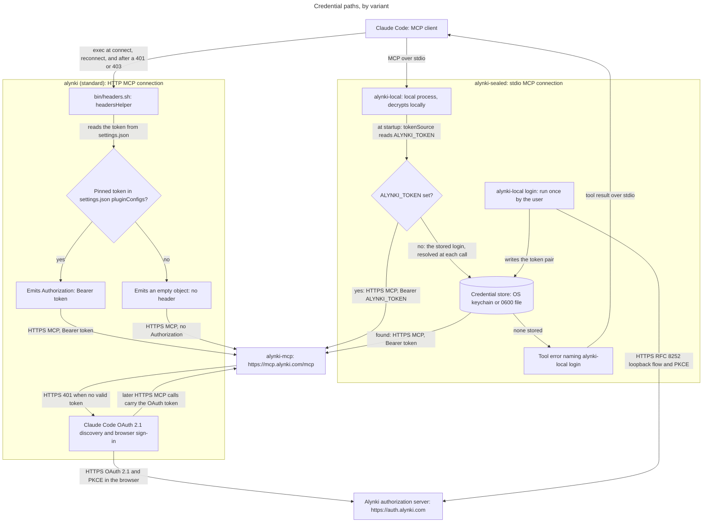
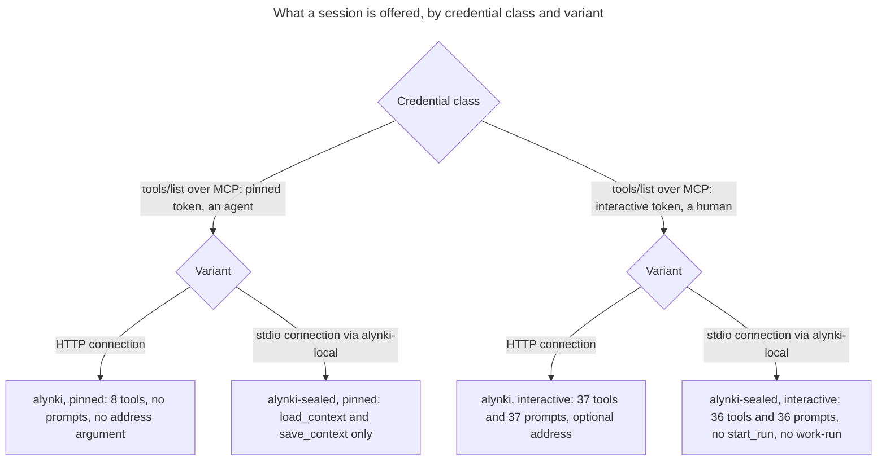
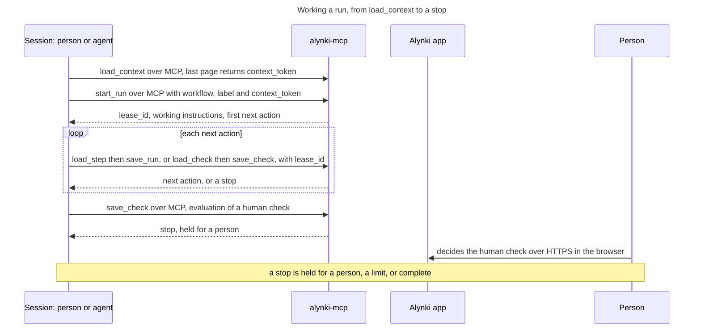
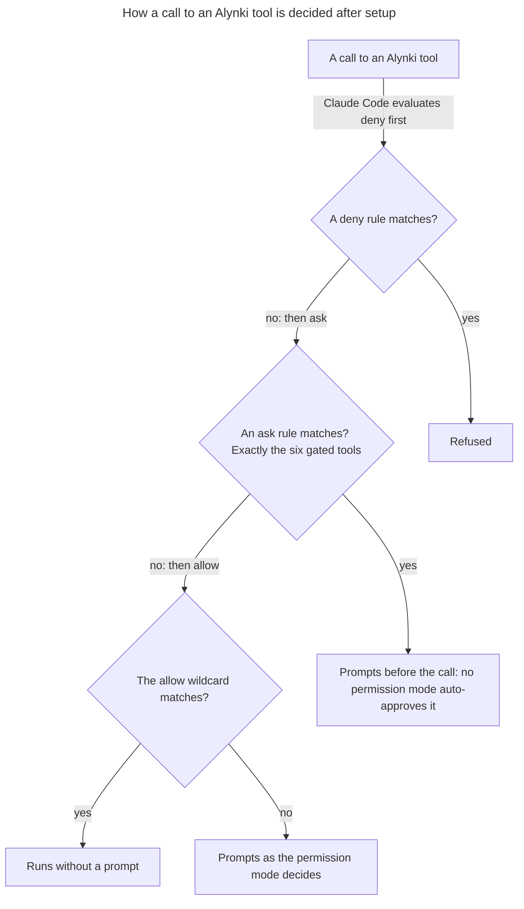

# Alynki plugin

> Knowledge is inherited, not rediscovered.

The Claude Code plugin for Alynki, the business context layer. It loads your organisation's
governed context into every session: the policy and product context for the scope your credential
holds and, where that scope sits in a workflow, the steps, checks and runs that define how the work
is done. Alynki delivers to a principal only what that principal is granted; it does not constrain
what an agent obtains from other sources.

Two variants ship from this marketplace: **`alynki`** (the standard install) and
**`alynki-sealed`** (for organisations that have opted into sealing: context is decrypted locally
on your machine). Install one or the other, as your Alynki operator directs.

## Repository layout

- [`.claude-plugin/marketplace.json`](.claude-plugin/marketplace.json): the marketplace
  `alynki-marketplace`, listing both plugins.
- `alynki-plugin/` (`alynki`): an HTTP MCP connection, the `bin/headers.sh` header helper, the
  session hooks and the [`setup` skill](alynki-plugin/skills/setup/SKILL.md).
- `alynki-sealed-plugin/` (`alynki-sealed`): a stdio MCP connection to `alynki-local`, the session
  hooks and the [`setup` skill](alynki-sealed-plugin/skills/setup/SKILL.md).

The two `setup/SKILL.md` files are byte-identical **by design**: each plugin is installed alone and
cannot reference a file outside its own directory. Change both together.

## Credential paths

Both variants offer the same two paths: sign in with your own identity, or hold a pinned token. A
pinned token always wins when both are present.


```mermaid
---
title: Credential paths, by variant
---
graph TB
  cc["Claude Code: MCP client"]
  srv["alynki-mcp: https://mcp.alynki.com/mcp"]
  auth["Alynki authorization server: https://auth.alynki.com"]

  subgraph std["alynki (standard): HTTP MCP connection"]
    helper["bin/headers.sh: headersHelper"]
    tok{"Pinned token in settings.json pluginConfigs?"}
    hdr["Emits Authorization: Bearer token"]
    none["Emits an empty object: no header"]
    oauth["Claude Code OAuth 2.1 discovery and browser sign-in"]
  end

  subgraph sld["alynki-sealed: stdio MCP connection"]
    local["alynki-local: local process, decrypts locally"]
    envtok{"ALYNKI_TOKEN set?"}
    store[("Credential store: OS keychain or 0600 file")]
    login["alynki-local login: run once by the user"]
    err["Tool error naming alynki-local login"]
  end

  cc -->|"exec at connect, reconnect, and after a 401 or 403"| helper
  helper -->|"reads the token from settings.json"| tok
  tok -->|"yes"| hdr
  tok -->|"no"| none
  hdr -->|"HTTPS MCP, Bearer token"| srv
  none -->|"HTTPS MCP, no Authorization"| srv
  srv -->|"HTTPS 401 when no valid token"| oauth
  oauth -->|"HTTPS OAuth 2.1 and PKCE in the browser"| auth
  oauth -->|"later HTTPS MCP calls carry the OAuth token"| srv

  cc -->|"MCP over stdio"| local
  local -->|"at startup: tokenSource reads ALYNKI_TOKEN"| envtok
  envtok -->|"yes: HTTPS MCP, Bearer ALYNKI_TOKEN"| srv
  envtok -->|"no: the stored login, resolved at each call"| store
  store -->|"found: HTTPS MCP, Bearer token"| srv
  store -->|"none stored"| err
  err -->|"tool result over stdio"| cc
  login -->|"HTTPS RFC 8252 loopback flow and PKCE"| auth
  login -->|"writes the token pair"| store
```

Key: rectangle, a process or message; diamond, a decision; cylinder, a credential store on this
machine; the two boxed groups are the two variants.

A static `headers.Authorization` key in `.mcp.json` would disable Claude Code's OAuth fallback
unconditionally, even when its value is empty, so the standard plugin decides at connection time
with a `headersHelper` script. The script reads the token with `jq`; without `jq` on `PATH` it emits
no header and the session signs in instead. An agent working a run unattended has one credential,
its pinned token, and never sees a sign-in prompt.

## Install: `alynki` (standard)

```
/plugin marketplace add alynki/plugin
/plugin install alynki@alynki-marketplace
/reload-plugins
```

That is the whole install: **the MCP connection is bundled**, with no `claude mcp add` step.

**To sign in with your own identity**, install and use it; run `/mcp` to sign in when prompted.

**If you hold a pinned token**, an agent you revealed in the Alynki app (it expires 90 days after
the reveal) or one your operator issued, put it in the plugin's **Alynki API token** field
(`/plugin`, or `--config token=…` on install). The token is stored in `settings.json`, where `headers.sh` reads it.
Automation always uses a pinned token, since sign-in
needs a human in a browser.

## Install: `alynki-sealed`

For organisations that have opted into sealing. **A local process, `alynki-local`, runs on your
machine**: Claude Code launches it for each session, it calls the same hosted endpoint and decrypts
your context locally. The hosted service stores and serves ciphertext only; your organisation key
never leaves this machine.

⚠️ **The trade-off: sealing works only in clients that can run a local process**, Claude Code and
other CLI-class clients. **Hosted chat apps cannot use it:** claude.ai on the web, Desktop and
mobile connect to the hosted endpoint directly, so a sealed organisation's context is unavailable
there, and the Alynki browser app is unavailable to a sealed organisation too. An organisation that
needs those surfaces uses the standard variant.

`alynki-local` must be on your `PATH` before the plugin can serve context. Your Alynki operator
provides the binary for your platform; installing the plugin does not install it. Confirm:

```sh
which alynki-local     # must print a path
```

(Building from source, `go install ./cmd/alynki-local` from an `alynki/server` checkout, is an
operator or developer path, not a colleague path.) Then:

```
/plugin marketplace add alynki/plugin
/plugin install alynki-sealed@alynki-marketplace
/reload-plugins
```

Installing prompts for three values, **all optional** (each can instead be set up by running
`alynki-local` once from a terminal). ⚠️ **No tenant is asked for**: it is resolved from your
credential, server-side (*Status*).

- **Alynki API token**: leave blank and run `alynki-local login` to sign in with your own
  identity. A pinned token, when set, wins over a stored login. A token entered here is held in
  Claude Code's secure credential storage; the `alynki-local login` store (your OS keychain, with a
  file fallback) is the better place for a long-lived credential.
- **Alynki organisation key** and **Alynki key id**: leave both blank and run
  `alynki-local key import` (with `ALYNKI_KEY` and `ALYNKI_KEY_ID` set in your shell), so the key
  lives in the `alynki-local` store and never in this plugin's configuration.

Non-interactive form:

```
claude plugin install alynki-sealed@alynki-marketplace --config token=<token> --config key=<key> --config key_id=<key-id>
```

## What it installs


```mermaid
---
title: What a session is offered, by credential class and variant
---
graph TB
  cls{"Credential class"}
  pinv{"Variant"}
  intv{"Variant"}
  p8["alynki, pinned: 8 tools, no prompts, no address argument"]
  ps["alynki-sealed, pinned: load_context and save_context only"]
  i37["alynki, interactive: 37 tools and 37 prompts, optional address"]
  i36["alynki-sealed, interactive: 36 tools and 36 prompts, no start_run, no work-run"]

  cls -->|"tools/list over MCP: pinned token, an agent"| pinv
  cls -->|"tools/list over MCP: interactive token, a human"| intv
  pinv -->|"HTTP connection"| p8
  pinv -->|"stdio connection via alynki-local"| ps
  intv -->|"HTTP connection"| i37
  intv -->|"stdio connection via alynki-local"| i36
```

Key: diamond, a decision made by the server (class) or by the plugin you installed (variant);
rectangle, the surface a session is offered.

- **Pinned** (agent) credentials, including one working a run unattended, are offered exactly
  **eight tools**: `load_context`, `save_context`, `start_run`, `load_run`, `load_step`,
  `load_check`, `save_run` and `save_check`. `load_context` and `save_context` take **no address
  argument**: scope comes entirely from the token, so an injected instruction cannot redirect it.
  The run tools take only a run's workflow and label, or a step's or check's address handed over by
  a run's own next action. No authoring, deletion, move, people or agent tool is served to a pinned
  credential: calling one is the refusal for a tool that does not exist.
- **Interactive** (human) credentials are offered all **thirty-seven** tools (the eight plus every
  node, workflow, people, agent, connection and trigger tool). Every tool but `start_run` has a
  typed slash prompt taking one whole-string argument, and the composite prompt **`work-run`**
  covers `start_run`: thirty-seven prompts. Prompts are never offered to a pinned credential.
- **Large context is chunked and paged for you on the human surface**; a pinned session receives
  its payload whole. The tool descriptions and prompts carry the exact rules. What each tool does,
  and how confirm tokens, the run lease, the context token, run holds and non-composing reads work,
  is the server's contract: see `alynki/alynki` `docs/architecture/run-continuation.md` and
  `docs/architecture/tool-descriptions.md`.
- The standard connection goes straight to the hosted server. The sealed one goes to `alynki-local`,
  which calls the hosted server, decrypts the result, and does the chunking and paging on this
  machine, so the hosted service sees only whole ciphertext. **The run surface above is the
  standard variant's**: Alynki serves runs to unsealed organisations only, so `alynki-local`
  mirrors none of it.
- `SessionStart` and `SubagentStart` hooks that instruct every session, and every subagent, to call
  `load_context` first (`SessionStart` emits both `initialUserMessage` and `additionalContext`;
  `SubagentStart` emits `additionalContext`). The text names only `load_context`, which every
  credential class holds.

⚠️ A new sealed capability reaches you only with a redistributed `alynki-local` binary, wording
included: the sealed variant declares its tool descriptions, renders its prompts and answers the
server's `instructions` string *locally*. Nothing warns you of a wording-only change, because the
staleness nudge compares tool **schemas** byte-for-byte, so an older binary keeps serving the stale
wording. **Reinstall `alynki-local` whenever the sealed plugin's version moves.** A genuine schema
change is the one case an old binary catches itself: it withholds the changed tool, with one
`OUT OF DATE` log line, until rebuilt. A changed tool *result* needs no rebuild: results are relayed
from the hosted server verbatim.

## Working a run

A run (a workflow's steps and checks, in progress against one label) is worked the same way by a
person or an agent, in the standard variant.


```mermaid
---
title: Working a run, from load_context to a stop
---
sequenceDiagram
  participant S as Session: person or agent
  participant M as alynki-mcp
  participant A as Alynki app
  participant P as Person

  S->>M: load_context over MCP, last page returns context_token
  S->>M: start_run over MCP with workflow, label and context_token
  M-->>S: lease_id, working instructions, first next action
  loop each next action
    S->>M: load_step then save_run, or load_check then save_check, with lease_id
    M-->>S: next action, or a stop
  end
  S->>M: save_check over MCP, evaluation of a human check
  M-->>S: stop, held for a person
  P->>A: decides the human check over HTTPS in the browser
  Note over S,P: a stop is held for a person, a limit, or complete
```

Key: solid arrow, a request; dashed arrow, a reply; the loop ends at a stop.

- **In an interactive session**, the `work-run` prompt takes the workflow's address and the run's
  label and works the run to a stop. Unattended work runs through `alynki-controller`, a separate
  customer-side piece that embeds a copy of this plugin: it polls Alynki's controller API (never
  MCP, a different credential and surface) for ready runs and starts one headless session per run it
  reserves; that session calls `load_context` and `start_run` over MCP as an interactive one does.
- **A pinned session** gets a `context_token` from `load_context`'s last page, required by every
  run, step and check tool, and a `lease_id` from `start_run`, required by every write. Every write
  returns the next action or a stop; following it verbatim is the whole loop.
- **A human check is decided in the app only, by a person, never over MCP**, by any credential.
  `save_check` records the evaluation and hands the run to a person; deciding it (`approved`) is
  refused and says so.
- **A revoked agent is kept, never deleted.** Its credential and every run record it left stay,
  shown as revoked in the Alynki app.

## After installing: grant standing permission

A plugin cannot pre-approve its own tool calls, and has no install-time hook. Left alone, each
session prompts for `load_context` the first time it runs, and accepting saves the grant to that
**repository only**; a session started anywhere else prompts again.

Run once, in any session:

```
/alynki:setup
```

(`/alynki-sealed:setup` for the sealed variant.) It shows the edit, then adds to your own
`~/.claude/settings.json`, machine-wide:

- the wildcard `mcp__plugin_alynki_alynki__*` to `permissions.allow`, covering every Alynki tool
  including ones added later (the `plugin_alynki_alynki` segment is exact, so it can only match
  Alynki's own server);
- six exact-name rules to `permissions.ask`, so the tools that change who has access or create a
  credential still prompt before every call: `grant_principal`, `revoke_principal`,
  `invite_principal`, `revoke_principal_invite`, `create_principal_agent` and
  `revoke_principal_agent`.


```mermaid
---
title: How a call to an Alynki tool is decided after setup
---
graph TB
  req["A call to an Alynki tool"]
  deny{"A deny rule matches?"}
  ask{"An ask rule matches? Exactly the six gated tools"}
  allow{"The allow wildcard matches?"}
  refused["Refused"]
  prompt["Prompts before the call: no permission mode auto-approves it"]
  run["Runs without a prompt"]
  mode["Prompts as the permission mode decides"]

  req -->|"Claude Code evaluates deny first"| deny
  deny -->|"yes"| refused
  deny -->|"no: then ask"| ask
  ask -->|"yes"| prompt
  ask -->|"no: then allow"| allow
  allow -->|"yes"| run
  allow -->|"no"| mode
```

Key: diamond, a rule check in Claude Code's fixed order; rectangle, the outcome.

Re-running the command adds any rule that is missing and changes nothing else. ⚠️ The gate lives in
this client: a non-interactive
`-p` run without `--permission-prompt-tool` cannot answer the prompt, `dontAsk` denies these calls,
and another MCP client may not prompt at all.

⚠️ **This command still prompts once, for its own write.** `~/.claude` is a protected path, so no
allow rule suppresses that prompt. It removes every *subsequent* Alynki prompt, not its own.

To grant it by hand, add to `~/.claude/settings.json` (substitute `plugin_alynki-sealed_alynki` for
the sealed variant, in all seven entries), keeping existing entries:

```json
{
  "permissions": {
    "allow": [
      "mcp__plugin_alynki_alynki__*"
    ],
    "ask": [
      "mcp__plugin_alynki_alynki__grant_principal",
      "mcp__plugin_alynki_alynki__revoke_principal",
      "mcp__plugin_alynki_alynki__invite_principal",
      "mcp__plugin_alynki_alynki__revoke_principal_invite",
      "mcp__plugin_alynki_alynki__create_principal_agent",
      "mcp__plugin_alynki_alynki__revoke_principal_agent"
    ]
  }
}
```

## Status

- **One shared endpoint: `https://mcp.alynki.com/mcp`.** Your tenant is resolved server-side from
  the credential, never from the URL, so **neither variant asks for a tenant** and both `.mcp.json`
  files carry the same literal URL. ⚠️ **RFC 9728 §3.3 requires** the `resource` identifier a client
  is handed to be identical to the URL it dialled, so one shared URL and one shared resource
  identifier are the same decision. For development against a local server, make an **uncommitted**
  working-copy change: `main` only ever carries production.
- **Visibility:** this repository is **public** (`alynki/github-infrastructure`'s
  `repositories.tf`). A plugin marketplace must be installable without git access to a private
  Alynki repository, and this one carries nothing that needs it (*Content policy*).

## Content policy: read before adding anything

**This repository is public.** It exists so the plugin can be installed without access to
`alynki/alynki`, which is private, and contains **only** the plugin and its marketplace manifest.
The following are **explicitly excluded** and must never be added: VISION, architecture documents,
feature specifications, patent material, the risk register, competitor analysis, anything carrying
a confidentiality banner. CI greps every push for the banner and fails the build if one appears.

Nothing customer-specific may appear in the plugin either. The plugin is identical for every
installer; a node label or tenant name in these files would leak one customer's structure to all
others.

## Licence

MIT, see [LICENSE](LICENSE). It covers the plugin configuration in this repository only.
